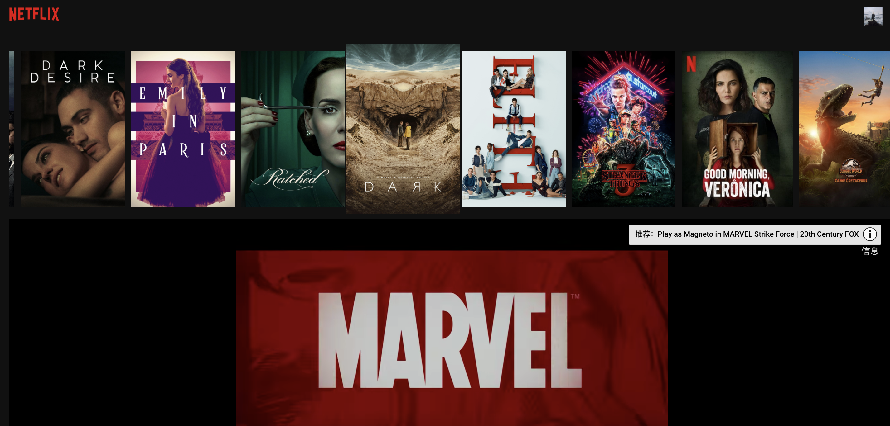

# Netflix UI Clone

基于 React 开发的模仿 Netflix 的纯前端项目，使用了[TMDB API](https://www.themoviedb.org/documentation/api)作为电影数据来源，并使用[react-youtube](https://www.npmjs.com/package/react-youtube) 实现页面内电影的 trailer 播放。

